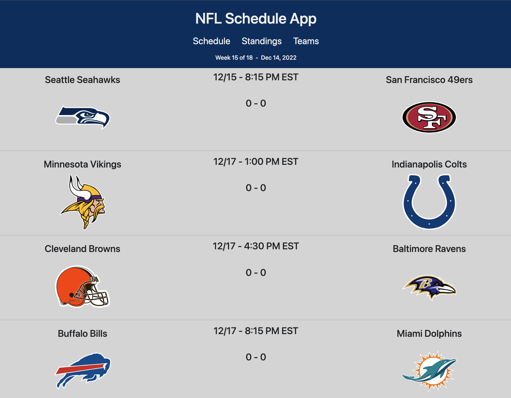

# Football Schedule App
The Football Schedule App is a dashboard which allows a user to see the current National Football League schedule (with scoreboard), standings, and team information.

## Description

This app was built so that we could combine information that fans of football would want to find in one place. It contains:

- The scoreboard for the current week
- The current standings per division
- A team page with information about each team, with the ability to save favorite teams

## Usage

1. Navigate to the app on Github Pages
2. Check out the standings page and the team page
3. When on the team page, click the "Favorite" button to save the team

    

## Credits

Collaborators:

[Casey Dwyer](https://github.com/exzilium)
[Kevin Moreno](https://github.com/ClassyKD)
[Kyle Grillot](https://github.com/kyle10888)
[Mariano Rojano](https://github.com/mawiano)

Data provided by [ESPN API](http://www.espn.com/apis/devcenter/docs/)